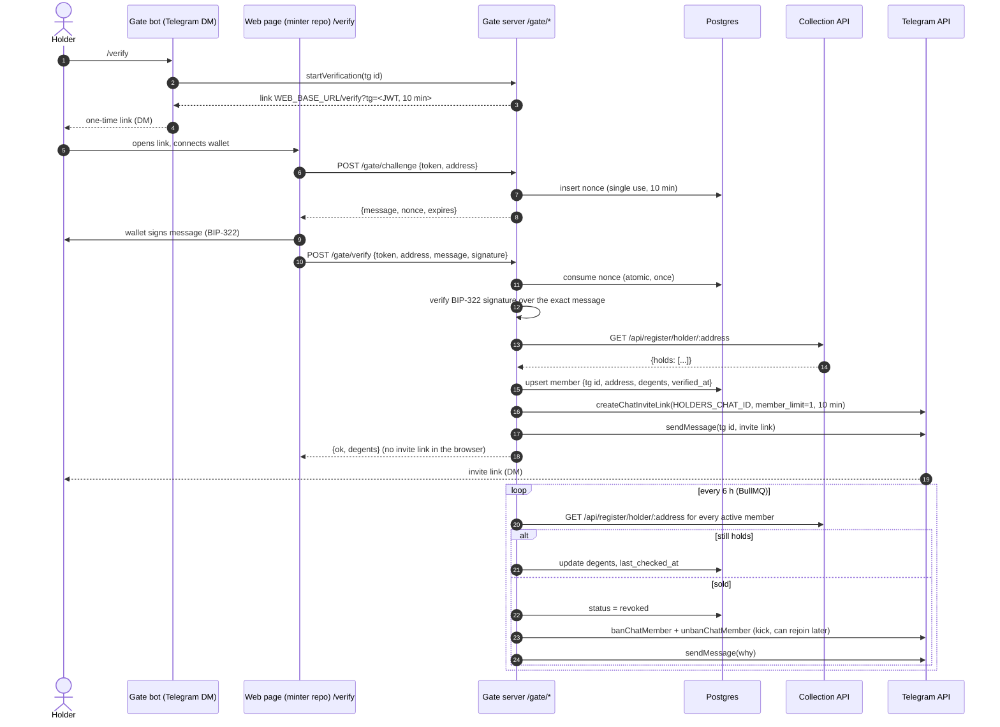

# Telegram holders gate

A separate service (`npm run gate`, compose service `telegram-gate`) that
lets a wallet prove it holds a Degent and receive a single-use invite to the
holders-only Telegram group, then keeps re-checking so sellers are removed.

Code: `src/telegram-gate/`. Tables: `gate_challenges`, `gate_members`
(migration `src/db/migrations/0001_telegram_gate.sql`).

## Flow



### The signed message

Exactly five lines, LF separated, no trailing newline. The server rebuilds
it from the stored challenge and compares byte for byte, so the wallet must
sign it unmodified:

```
degent.club telegram
telegram:<tg user id>
address:<address>
nonce:<32 hex chars>
expires:<ISO 8601>
```

Signature: BIP-322 "simple" (base64), verified with `bip322-js`. Supported
address types are P2WPKH (`bc1q…`), P2SH-P2WPKH and single-key P2TR
(`bc1p…`). Legacy P2PKH signatures (BIP-137) are also accepted by the
verifier.

### Endpoints (`GATE_PORT`, default 3001)

| Method | Path | Auth | Body → Response |
|--------|------|------|-----------------|
| POST | `/gate/challenge` | link token | `{token, address}` → `{message, nonce, expires}` |
| POST | `/gate/verify` | link token | `{token, address, message, signature}` → `{ok, degents}` |
| GET | `/gate/stats` | admin JWT (`Authorization: Bearer`, minted by the main bot's `/api/auth/login`) | `{activeMembers, revokedMembers, degentsHeld, openChallenges}` |
| GET | `/gate/health` | none | `{status}` |

Errors are `{error: <code>, message}` with codes: `bad_token` (401),
`bad_address`, `bad_message`, `bad_nonce` (401), `bad_signature` (401),
`not_a_holder` (403), `address_taken` (409), `telegram_taken` (409),
`rate_limited` (429).

CORS is restricted to `WEB_BASE_URL`.

### Rules enforced

- Link tokens are HS256 JWTs signed with `GATE_JWT_SECRET`, 10 minutes,
  carrying only the Telegram user id.
- A nonce is consumed by a single `UPDATE … WHERE used_at IS NULL AND
  expires_at > now()` so concurrent replays cannot both succeed.
- One wallet ↔ one Telegram account. A wallet linked to another active
  account is refused at `/gate/challenge` (before the user signs anything)
  and again at `/gate/verify`, with a message naming the conflict. The same
  pair may re-verify (lost invite) and gets a fresh invite. Revocation
  frees both sides.
- Exactly one invite per successful verification, `member_limit: 1`,
  expiring in 10 minutes, delivered by DM only.
- `/verify` is rate limited to 3 per 10 minutes per Telegram user.
- The re-check never kicks on a collection API error; it logs and retries
  on the next run.
- Holder lookups are cached 5 minutes and retried with exponential backoff
  (500 ms, 1 s, 2 s) on 5xx / 429 / network errors. Verification and the
  re-check always bypass the cache (`fresh: true`).

## Environment variables

| Variable | Required | Notes |
|----------|----------|-------|
| `TELEGRAM_GATE_BOT_TOKEN` | yes | A dedicated bot (from @BotFather). Not the content-pipeline bot. |
| `HOLDERS_CHAT_ID` | yes | The private group's id (negative number, e.g. `-1001234567890`). |
| `WEB_BASE_URL` | yes | Absolute URL of the minter web app that serves `/verify`. Also the only CORS origin. |
| `REGISTER_API_URL` | yes | Base URL of the collection API; `GET /api/register/holder/:address` must return `{holds: number[]}` (404 = holds nothing). |
| `GATE_JWT_SECRET` | yes | ≥ 32 chars, must differ from `JWT_SECRET`. |
| `GATE_PORT` | no (3001) | Callback server port. |
| `GATE_REPO` | no | `memory` for a dry run without Postgres (nothing persisted). |
| plus the base set | | `DATABASE_URL`, `REDIS_URL`, `JWT_SECRET` (for `/gate/stats`), `ADMIN_*` — validated the same way as the main bot. |

## Owner setup

1. **Create the bot**: @BotFather → `/newbot` → copy the token into
   `TELEGRAM_GATE_BOT_TOKEN`. Under `/setprivacy` leave privacy mode on; the
   gate only needs private messages.
2. **Make it an admin of the holders group** with these rights:
   - *Invite users via link* — required for `createChatInviteLink`.
   - *Ban users* — required for kicking sellers (`banChatMember` /
     `unbanChatMember`).
   - Everything else can stay off.
3. **Find the chat id**: add the bot to the group, send any message, and
   read `chat.id` from `https://api.telegram.org/bot<token>/getUpdates`
   (or forward a message to @userinfobot). Put it in `HOLDERS_CHAT_ID`.
4. **Turn off the group's public invite link** and set "Approve new
   members" off (the bot's single-use links are the only way in).
5. **Web page**: the minter repo serves `WEB_BASE_URL/verify`. It reads
   `tg` from the query string, asks the user to connect a wallet, calls
   `POST /gate/challenge`, has the wallet sign `message` with BIP-322
   (`signMessage` in Xverse / UniSat / Leather with protocol `BIP322`), then
   calls `POST /gate/verify`. On `ok`, tell the user to check their Telegram
   DMs. Never display an invite link on the page.
6. **Secrets**: `GATE_JWT_SECRET=$(openssl rand -hex 32)`.
7. **Migrate**: `npm run db:migrate` (or `db:push`) to create the two tables.
8. **Run**: `docker compose up -d telegram-gate` (or `npm run gate`).
   `curl localhost:3001/gate/health`.
9. **Watch**: `GET /gate/stats` with an admin token; logs are tagged
   `gate:`.

## Privacy

The gate stores the Telegram user id, the verified address, the inscription
numbers held at the last check, and timestamps. No usernames, no messages,
no IP addresses, no signatures (the signature is verified and discarded).
Challenges keep the id and address for the 10-minute window and are marked
used; they can be purged at any time.

## Tests

`npm test` covers: message build/parse and BIP-322 round-trip with keys
generated in the test (P2WPKH and P2TR), token expiry/tampering, nonce
single use and expiry, holder client caching/retries/404, exactly-one-invite
per verification, kick/keep behaviour of the re-check, one-to-one
wallet↔Telegram enforcement, the `/verify` rate limit, and the HTTP layer
(status mapping, admin auth, CORS, no invite leakage).
