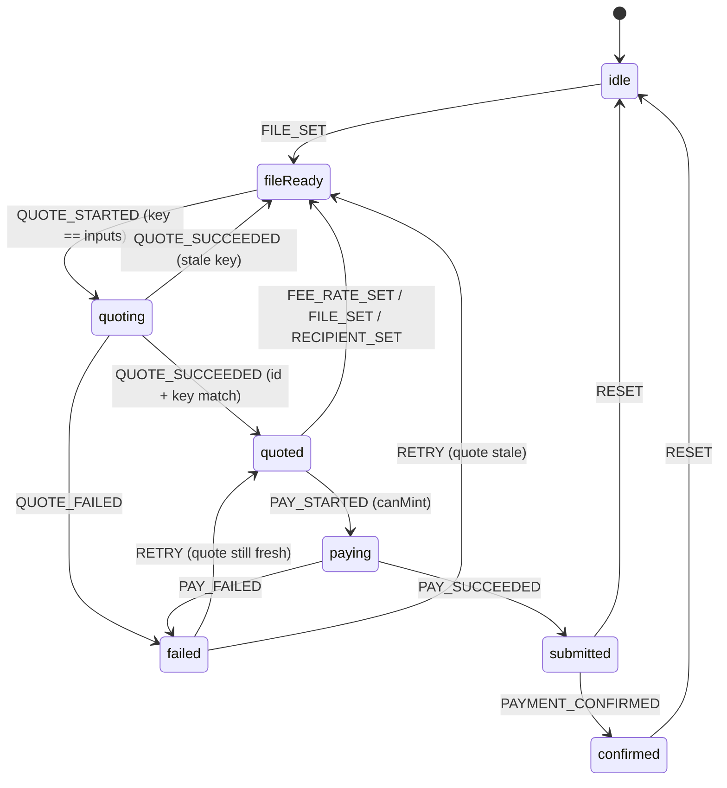
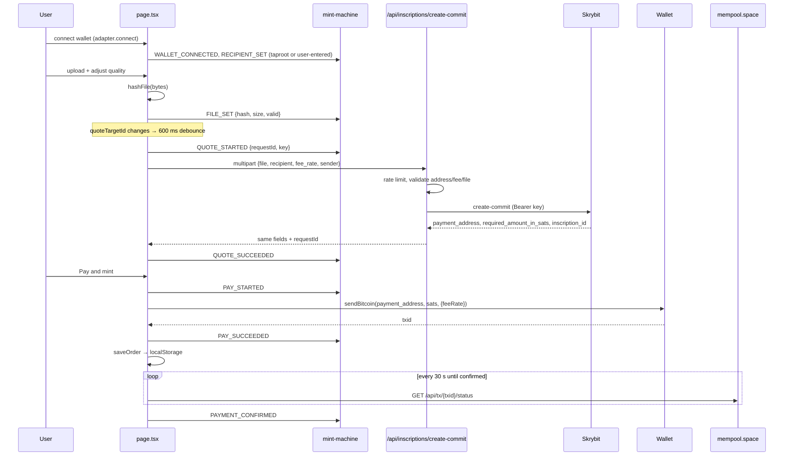

# Architecture

Degen Minter is a single-page Next.js 14 (App Router) app. The browser does
the heavy lifting (compression, hashing, wallet signing); the server is a thin
proxy that keeps the Skrybit key secret and enforces input rules.

```
browser ──(multipart)──▶ /api/inscriptions/create-commit ──▶ api.skrybit.io
   │                                                          (quote: address + sats)
   ├──(sendBitcoin)────▶ wallet extension ──▶ Bitcoin network
   └──(GET)────────────▶ mempool.space (fees, price, tx status)
```

## Directory map

| Path                                        | Role                                                         |
| ------------------------------------------- | ------------------------------------------------------------ |
| `lib/mint-machine.ts`                       | Pure reducer for one order. No I/O.                          |
| `lib/fees.ts`                               | Fee bounds, estimates, mempool.space presets and BTC price.  |
| `lib/address.ts`                            | Checksum-verified mainnet address validation.                |
| `lib/wallet.ts`                             | `WalletAdapter` interface + UniSat and sats-connect adapters. |
| `lib/api.ts`                                | Client for our proxy, file rules, SHA-256 hashing.           |
| `lib/orders.ts`                             | localStorage persistence of submitted orders.                |
| `lib/rate-limit.ts`                         | In-memory sliding-window limiter.                            |
| `app/page.tsx`                              | Wires the machine to components; owns the quote effect.      |
| `app/api/inscriptions/create-commit/route.ts` | Validating, rate-limited proxy to Skrybit.                 |
| `app/api/health/route.ts`                   | Liveness probe.                                              |
| `components/*`                              | Presentational; they dispatch actions, never fetch quotes.   |
| `tests/*`                                   | Vitest unit tests (jsdom).                                   |

## The mint state machine



Key rules (all covered in `tests/mint-machine.test.ts`):

- **Quotes are keyed** by `{feeRate, fileHash, recipient}`. `canMint()` is true
  only in `quoted` when the stored quote's key equals the key derived from the
  current inputs. Editing the fee rate during the debounce therefore disables
  the button instantly; there is no window where a stale amount can be paid.
- **Request ids** make late responses harmless: a `QUOTE_SUCCEEDED` whose id
  or key does not match is dropped.
- **`paying`, `submitted`, `confirmed` are locked.** Input actions are ignored,
  `PAY_STARTED` is refused, and only `RESET` starts a new order. A second click
  cannot pay twice. `page.tsx` adds a synchronous `payingRef` guard for the
  render gap between two clicks.
- **No automatic retries.** After `failed` the user must press Retry or change
  an input; `attempt` is bumped so the effect sees a new target.
- **High fees need consent.** Above `FEE_WARN` (50 sat/vB) the user must
  confirm in-page; any fee change resets the confirmation.

## Sequence of a mint



## Wallet adapters

`lib/wallet.ts` exposes:

```ts
interface WalletAdapter {
  id; name; installUrl;
  isInstalled(): boolean;
  connect(): Promise<{ address, publicKey?, network, ordinalsAddress? }>;
  disconnect(): Promise<void>;
  sendBitcoin(to, sats, { feeRate }): Promise<txid>;
  onAccountsChanged(handler): unsubscribe;
}
```

- **UniSat** talks to `window.unisat` directly and passes `{ feeRate }` to
  `sendBitcoin`. Network comes from `getChain()` / `getNetwork()`.
- **Xverse, Leather, OKX, Magic Eden** go through sats-connect's JSON-RPC
  (`wallet_connect` → fallback `getAccounts`; `sendTransfer`). Providers are
  found through the WBIP-004 registry (`window.btc_providers`) or their known
  window paths. `sendTransfer` has no fee-rate parameter, so those wallets
  choose the payment fee in their own UI. `sats-connect` is imported lazily so
  it never runs during SSR.

Anything not on mainnet is rejected before a quote is requested. The recipient
must be taproot; if the connected address is not, the user pastes a bc1p
address which is checksum-validated client-side and again on the server.

## API routes

| Route                                   | Method | Purpose                                           |
| --------------------------------------- | ------ | ------------------------------------------------- |
| `/api/inscriptions/create-commit`       | POST   | Validate + rate limit, then proxy to Skrybit.     |
| `/api/health`                           | GET    | `{ ok, configured }` for Docker/LB health checks. |

Both declare `runtime = 'nodejs'`.

## Order tracking

After payment the order (`inscriptionId`, `paymentAddress`, `txid`,
`amountSats`, `feeRate`, `fileHash`, `recipient`, `createdAt`, `status`) is
written to `localStorage` under `degen-minter:orders:v1`. On load the latest
non-dismissed order is shown in `OrderTracker`, which polls mempool.space until
the payment confirms. "Mint another" marks the order dismissed and resets the
machine. There is no server-side order store.

## Security model

See [SECURITY.md](./SECURITY.md).
