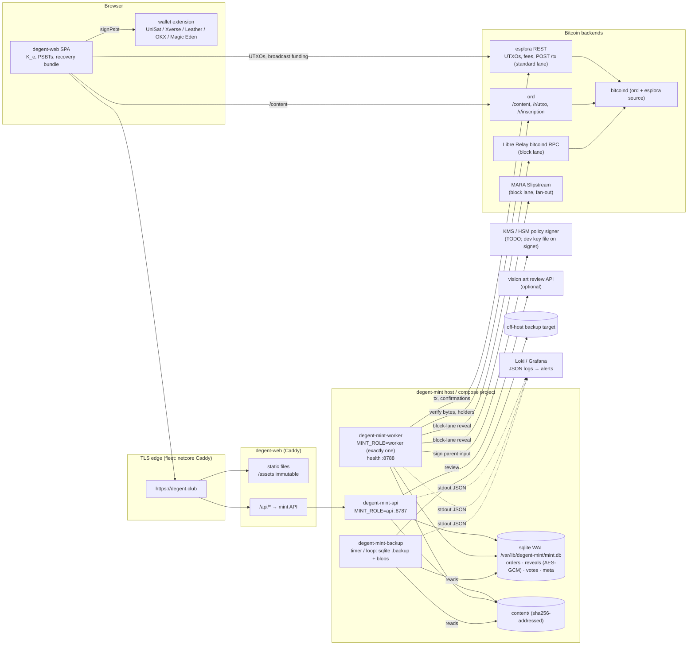

# Deploying degent-mint and degent-web

How the degent.club mint (`@bsh/degent-mint`) and front end (`@bsh/degent-web`) are packaged, configured,
backed up, observed and wired into the fleet. Runbook for incidents: [`RUNBOOK.md`](../products/degent/services/mint/RUNBOOK.md).
Signet rehearsal: [`REHEARSAL.md`](./REHEARSAL.md). Architecture: [ADR-0002](./adr/0002-degent-mint-architecture.md),
[ADR-0005](./adr/0005-sighash-all-anyonecanpay-reveals.md), [ADR-0007](./adr/0007-member-approval-and-register.md).

> **Mainnet cannot start yet.** The service refuses mainnet with the in-memory dev signer, and the KMS/HSM
> `PolicySigner` is an interface only (`services/mint/src/adapters/kms-policy-signer.ts`). Everything below
> is ready for mainnet and statically checked, but a mainnet deploy needs that adapter first.

## What is where

| Path | What |
|---|---|
| `products/degent/deploy/mint.Dockerfile` | Multi-stage: pnpm filtered install, esbuild bundle (`pnpm --filter @bsh/degent-mint build` → `dist/main.mjs`), `pnpm deploy`; runtime on `node:22-bookworm-slim` as the non-root `node` user, `HEALTHCHECK` on `/v1/health`, commands `api` / `worker` / `all`; target `backup` (alpine + sqlite3) |
| `products/degent/deploy/web.Dockerfile` | Vite build → Caddy as a non-root user; `Caddyfile` + `web-site.caddy` (security headers + CSP, SPA fallback, immutable `/assets`, same-origin `/api` proxy, `/healthz`) |
| `products/degent/deploy/compose.signet.yaml`, `compose.mainnet.yaml` | `mint-api`, `mint-worker`, `web`, `mint-backup`; sqlite on the `mint-data` volume; secrets as files |
| `products/degent/deploy/.env.{signet,mainnet}.example` | GENERATED from `services/mint/env.schema.json` + `deploy/compose-vars.json` by `pnpm deploy:env` |
| `products/degent/deploy/backup.sh` | sqlite online backup + content blobs, `--loop`, `--check`, `--restore` |
| `flake.nix`, `products/degent/deploy/nix/` | `packages.<system>.degent-mint`, `packages.<system>.degent-web`, `nixosModules.degent-mint`, `nixosModules.degent-web` |
| `scripts/rehearsal/` | Rehearsal checklist runner + scenarios ([`REHEARSAL.md`](./REHEARSAL.md)) |
| `products/degent/deploy/compose.server.yaml`, `server/` | **Release 1 on one server** (mint.degent.club mainnet read-only, degent.club 301, signet.degent.club): compose, Caddy edge, `bootstrap.sh`, `deploy.sh`, deployed by `.github/workflows/deploy.yml`. Guide: [`SERVER.md`](./SERVER.md) |
| `test/deploy.test.ts` | Static checks of all of the above (part of `pnpm test:root`, so of `pnpm check`) |

## Architecture



Processes: the API serves the public HTTP contract; the worker is the only process that signs (policy signer)
and broadcasts, and it must run **exactly once** (the parent UTXO chain is serial; the parent lease and
optimistic versioning protect the store, not two workers racing the mempool). API and worker share one
sqlite file (WAL, `busy_timeout`, `WHERE version = ?` on every write) and one content directory, so they must
run on the **same host** on a local filesystem (never NFS). `MINT_ROLE=all` runs both in one process (dev,
tiny installs).

## Build and run

### Containers

```bash
git submodule update --init                     # deps/scribbit (platform packages) is part of every build
docker build -f products/degent/deploy/mint.Dockerfile -t degent/mint .
docker build -f products/degent/deploy/mint.Dockerfile --target backup -t degent/mint-backup .
docker build -f products/degent/deploy/web.Dockerfile --build-arg VITE_NETWORK=signet -t degent/web .

cd products/degent/deploy
pnpm deploy:env                                  # only after changing env.schema.json / compose-vars.json
cp .env.signet.example .env.signet               # fill in the REQUIRED values
mkdir -m 0700 secrets                            # one file per secret, see below; chown 1000, chmod 0400
docker compose -f compose.signet.yaml --env-file .env.signet up -d --build
curl -s localhost:8080/api/v1/health
```

The web image bakes `VITE_*` at build time (public values), so it is built per network. The mint images are
network-agnostic: mainnet runs the exact mint image that was rehearsed on signet, promoted by tag
(`DEGENT_IMAGE_TAG`, required in `compose.mainnet.yaml`, which has no `build:` for the mint images).

Compose hardening: `read_only` root filesystems, `tmpfs /tmp`, `cap_drop: ALL`, `no-new-privileges`, only the
web port published (default `127.0.0.1:8080`, behind a TLS edge). The mint API is reachable only on the compose
network; the web container proxies `/api/*` to it, so the browser stays same-origin. The mint still needs
`CORS_ORIGINS=<the web origin>` (browsers send `Origin` on same-origin POSTs) and `TRUST_PROXY=true` (set by
compose) for per-client rate limiting; Caddy only forwards `X-Forwarded-For` from private-range proxies, walks it
right to left (`trusted_proxies_strict`) and sets `X-Client-IP` from its `{client_ip}`, which is the key the services
rate-limit on (never the client-supplied left-most `X-Forwarded-For` hop; `docs/security/findings.json` DGT-SEC-007).

### Nix

`flake.nix` exposes:

| Output | What |
|---|---|
| `packages.<system>.degent-mint` | `bin/degent-mint {api,worker,all}` (Node 22 + bundled `dist/main.mjs`), `bin/degent-mint-backup` (sqlite3, gzip on PATH) |
| `packages.<system>.degent-web` | the built front end (a directory with `index.html`); `.override { viteEnv = { VITE_NETWORK = "signet"; ... }; }` per environment |
| `nixosModules.degent-mint` | `services.degent-mint`: options for every required variable, every secret as a `*File` option (delivered with `LoadCredential`, read via `<NAME>_FILE`), units `degent-mint-api` + `degent-mint-worker` (dedicated user, `StateDirectory`, `ProtectSystem=strict`, `NoNewPrivileges`, empty capability set, syscall filter, ...), optional `degent-mint-backup` timer |
| `nixosModules.degent-web` | `services.degent-web`: a `services.caddy` virtual host serving the package with the same `web-site.caddy` body as the container |

**Status: real derivations, never built.** This repository's CI container has no Nix. The packages use
`pnpm_10.fetchDeps` (fixed-output, `fetcherVersion = 2`) + `pnpm_10.configHook` and then run the same
`pnpm --filter ... build` as the Dockerfiles, so a pure build is expected to work; the two dependency hashes
are `lib.fakeHash` placeholders. The first `nix build .#degent-mint` / `.#degent-web` fails with
`got: sha256-...`; pass it as `pnpmDepsHash` (or paste it as the default in `products/degent/deploy/nix/packages.nix`)
and commit. The workspace includes the `deps/scribbit` submodule: the flake sets `inputs.self.submodules = true`
(Nix >= 2.27); consumers must use `git+https://github.com/DegentClub/degent?ref=main&submodules=1`. If
`pnpm_10.fetchDeps` is renamed in a newer nixpkgs (`fetchPnpmDeps` / `pnpmConfigHook`), adjust those two lines.
`test/deploy.test.ts` checks the modules statically (option ↔ schema mapping, hardening, placeholders).

## Environments

> **Release 1 (single server, [`SERVER.md`](./SERVER.md))**: `compose.server.yaml` runs mainnet and public signet with
> `MINT_MODE=readonly` on public APIs (mempool.space, ordinals.com); no parent key, signer or node. The table below is the
> fleet/rehearsal plan.

| | Regtest dev | Signet rehearsal | Mainnet soft launch | Mainnet public |
|---|---|---|---|---|
| Run with | `pnpm --filter @bsh/degent-mint dev` + `pnpm --filter @bsh/degent-web dev` | `compose.signet.yaml` or the fleet host (NixOS module) | `compose.mainnet.yaml` or the fleet host | same, scaled edge |
| `NETWORK` | `regtest` | `signet` | `mainnet` | `mainnet` |
| Stores | in memory (or sqlite with `DATABASE_PATH`) | sqlite on a volume / `StateDirectory` | same | same |
| Parent signer | random ephemeral key | `SIGNER=memory` + `PARENT_KEY_FILE` (signet key) | `SIGNER=kms` (**adapter TODO: refuses to start**) | same |
| Standard lane | local esplora | signet esplora (`ESPLORA_URL`) | fleet mempool/esplora | same |
| Block lane | esplora fallback | `LIBRE_RPC_URL` → signet node with `acceptnonstdtxn=1` (the private signet miner) | **off** (standard tier only) unless `LIBRE_RPC_URL`/`SLIPSTREAM_URL` | Libre Relay (`libre-mainnet`) + Slipstream fan-out |
| Holder registry | `memory` | `roster-chain` with a **signet roster** (Gallery test Degents inscribed on signet) | `roster-chain`, `data/roster.json` | same |
| Art review | rules | rules (+ vision optional) | rules + vision | rules + vision |
| Review SLA / rescue timeout | defaults | `REVIEW_SLA_SECONDS=3600`, `RESCUE_AFTER_SECONDS=3600` (drills fit in a day) | defaults (14 d / 6 h) | defaults |
| Web | `vite` dev server, `?demo=1` | `web` image, `VITE_NETWORK=signet` | `VITE_NETWORK=mainnet`, invite-only origin (`CORS_ORIGINS`) | public `degent.club` |
| Backups | none | hourly, 48 kept | hourly + off-host copy, restore drill before launch | + monthly restore drill |
| Alerts | none | Loki queries below, notify only | page on critical, notify on stuck | same, tighter thresholds |
| Exit criteria | `pnpm check` | `rehearsal-report.json`: all scenarios pass ([`REHEARSAL.md`](./REHEARSAL.md)) | KMS signer shipped + reviewed; first N standard mints delivered; restore drill done | block lane rehearsed on signet and soft-launched |

## Configuration and secrets

Every variable is in [`services/mint/env.schema.json`](../products/degent/services/mint/env.schema.json);
`.env.*.example` are generated from it. Compose fixes the container-level ones (`NETWORK`, `MINT_ROLE`,
`HOST`, `PORT`, `DATABASE_PATH`, `CONTENT_DIR`, `SIGNER`, `PARENT_KEY_FILE`, `TRUST_PROXY`, `ROSTER_FILE`;
see `compose-vars.json`). Every secret is supplied as a **file**: `<NAME>_FILE` (Docker secrets in
`$SECRETS_DIR`, systemd `LoadCredential` from SOPS), never as an environment value; setting both is refused.
An empty file means unset for optional secrets.

| Secret file | Variable | Purpose | Needed | SOPS path (suggested) | Rotation |
|---|---|---|---|---|---|
| `reveal-encryption-key` | `REVEAL_ENCRYPTION_KEY` | 32-byte hex AES-256-GCM key encrypting stored half-signed reveals | every non-regtest network | `services/degent-mint/reveal-encryption-key` | Not in place: reveals stored under the old key become unreadable. Drain orders in `awaiting_payment`..`revealing` first (RUNBOOK §2 steps 1–2), then swap. Never store it with the backups. |
| `session-key` | `SESSION_KEY` | 32-byte hex Ed25519 key signing holder sessions (`@bsh/identity`) | every non-regtest network | `services/degent-mint/session-key` | Any time: new key + new `SESSION_KID`; members sign in again (TTL 1 h). |
| `parent-key` | `PARENT_KEY_FILE` | signet/testnet dev parent key (hex) for `SIGNER=memory` | signet only; **refused on mainnet** | `services/degent-mint/parent-key` (signet file only) | RUNBOOK §2 (move the parent inscription, re-initialise the parent). |
| `libre-rpc-pass` | `LIBRE_RPC_PASS` | Libre Relay bitcoind RPC password (block lane) | when `LIBRE_RPC_URL` is set | `services/degent-mint/libre-rpc-pass` (or reuse the node's `btc-nodes/.../rpc_password`) | Rotate on the node, update the secret, restart the worker; retryable failures keep orders safe meanwhile. |
| `slipstream-api-key` | `SLIPSTREAM_API_KEY` | MARA Slipstream API key (block lane) | when `SLIPSTREAM_URL` is set | `services/degent-mint/slipstream-api-key` | Vendor console; overlap old/new, restart the worker. |
| `art-review-api-key` | `ART_REVIEW_API_KEY` | vision art review API key | optional (rules-only without it) | `services/degent-mint/art-review-api-key` | Vendor console; restart the API. |
| `telegram-bot-token` | `TELEGRAM_BOT_TOKEN` | Telegram Bot API token for order notifications (`telegram_chat` channel) | optional (channel off without it) | `services/degent-mint/telegram-bot-token` | @BotFather `/revoke`, update the secret, restart the API and the worker. |
| (KMS credentials) | TBD with the KMS adapter | access to the parent key in KMS/HSM | mainnet | `services/degent-mint/kms/*` | per KMS policy; key compromise: RUNBOOK §2 |

Accounts and inputs only the owner can provide are listed in the handoff at the end of this page.

## Backups

What: the sqlite database (orders, encrypted half-signed reveals, votes, nonces, parent chain tip) and the
content blobs (`content/<aa>/<sha256>`, write-once). Losing the database while orders are paid loses the
service's half of every in-flight reveal; users can still self-rescue from their recovery bundles, but the
parent link for those orders is gone. Target: RPO 1 h (hourly), RTO 30 min.

- **Online backup**: `degent-mint-backup` runs sqlite's `.backup` (consistent under WAL while both processes
  run), `PRAGMA integrity_check`, gzip, keeps `BACKUP_KEEP` snapshots, and copies new content blobs. Compose:
  the `mint-backup` service (`--loop`, `HEALTHCHECK` = `--check`: newest backup younger than two intervals).
  NixOS: `services.degent-mint.backup.enable = true` (`degent-mint-backup.timer`, hourly, `Persistent`).
- **Private and encrypted**: backup files and directories are created `0600`/`0700` (umask 077; the mint process
  itself also runs with umask 077). With `BACKUP_AGE_RECIPIENT` (age public key(s); **required on mainnet** in
  compose and in the NixOS module, `backup.ageRecipient`) every database snapshot is encrypted before it is
  written (`mint-<ts>.db.gz.age`); keep the age identity offline with the operator, never on the backup host.
  Content blobs (the artworks, public once inscribed) are copied as private files, not encrypted.
- **Off-host**: ship `BACKUP_DIR` elsewhere (fleet: the backup host / object store). It is sensitive (encrypted
  reveals, recipient addresses, notification e-mail addresses and Telegram chat ids, votes); the reveal key must
  never be stored next to it.
- **Restore drill** (before the mainnet soft launch, then monthly; record the time taken):
  1. On a scratch host or compose project: `degent-mint-backup --restore <mint-<ts>.db.gz> /var/lib/degent-mint/mint.db`
     (refuses to overwrite; checks integrity; for `*.db.gz.age` set `BACKUP_AGE_IDENTITY=<identity file>`) and copy
     `BACKUP_DIR/content/` to `CONTENT_DIR`.
  2. Start the **API only** (`MINT_ROLE=api`) with the same `REVEAL_ENCRYPTION_KEY` and compare
     `GET /v1/queue`, `GET /v1/stats` and a sample of `GET /v1/orders/{id}` with production.
  3. Real recovery only: stop the old worker for good first, then start the worker on the restored data.
     Never run two workers against copies of the same parent chain.

## Observability

Logs are JSON lines on stdout (`time`, `level`, `service`, `msg`, fields); journald (NixOS) or the Docker
json-file driver ship them to Loki. Events (`degent.mint.order.<status>`) are on the in-process bus only until
the RabbitMQ adapter exists, so **alerts come from logs**. Every minute the worker logs one `mint gauges` line:
the flat gauges the ops dashboard reads (`memberReview`, `memberReviewOldestAgeSeconds`, `rescueAvailable`,
`queued`, `revealing`, `awaitingConfirmation`, `parentKnown` / `parentConfirmed` / `parentLeased` as 0/1;
`parentKnown` 0 = no parent UTXO, all reveals paused) plus `counts.<status>` and `oldestSeconds.<status>` for every
non-terminal status. The ready-made Grafana dashboard and Loki rules built on these lines are in
[`products/degent/ops/`](../products/degent/ops/README.md) (stream label `job="degent-mint"`); the table below is the
same set of signals written against the fleet's journald labels.

| Log `msg` | Fields | Meaning |
|---|---|---|
| `mint gauges` | `memberReview`, `memberReviewOldestAgeSeconds`, `rescueAvailable`, `queued`, `revealing`, `awaitingConfirmation`, `parentKnown`, `parentConfirmed`, `parentLeased`, `counts.*`, `oldestSeconds.*` | gauges for stuck orders, review backlog, rescue count, parent health |
| `order transition` | `orderId`, `from`, `to`, `detail`, `txid` | every worker transition |
| `broadcast failed` | `orderId`, `lane`, `via` (`esplora` / `libre-relay` / `slipstream`), `error`, `retryable` | lane broadcaster problems |
| `policy signer refused` | `orderId`, `violations` | order moved to `rescue_available`; should never happen for honest orders |
| `no parent UTXO configured; cannot reveal` | | reveals paused |
| `inscription sat fell into the fee`, `child output does not pay the recipient`, `reveal weight differs from quote` | `orderId`, `txid` | must-never-happen invariants: page |
| `order approved by members` / `order declined by members` | `orderId`, `degentNumber` / `declines` | approval throughput |
| `holder sign-in refused` | `error`, `detail` | SIWB problems (`domain_mismatch` = wrong `SIWB_DOMAIN`) |
| `configuration error` / `fatal` | `problems` / `error` | the process exited |
| `backup completed` (service `degent-mint-backup`) | `file`, `orders` | backup heartbeat |

Queries below use `{unit=~"degent-mint-(api|worker).service"}` (journald labels on the fleet); for compose use
`{container=~"degent-.*-mint-(api|worker)-1"}`. Loki's `json` parser flattens `counts.member_review` to
`counts_member_review`.

| Alert | LogQL | Threshold (soft launch) |
|---|---|---|
| Orders stuck in a status | `max_over_time({unit="degent-mint-worker.service"} \| json \| msg="mint gauges" \| unwrap oldestSeconds_revealing [10m])` (one rule per status: `paid`, `confirming`, `queued`, `revealing`, `revealed`, `confirmed`, `verified`) | `revealing` > 900 s, `paid`/`confirming` > 7200 s, `queued` > 3600 s (standard), `revealed` > 10800 s, `confirmed`/`verified` > 3600 s (ord lag) |
| Review backlog | `max_over_time({unit="degent-mint-worker.service"} \| json \| msg="mint gauges" \| unwrap memberReview [10m])` | > 20 orders, or `memberReviewOldestAgeSeconds` > 604800 (half the 14-day SLA) |
| Rescue available | `max_over_time({unit="degent-mint-worker.service"} \| json \| msg="mint gauges" \| unwrap rescueAvailable [10m])` | > 0 notify (users must act); rising for 1 h page |
| Parent missing | `min_over_time({unit="degent-mint-worker.service"} \| json \| msg="mint gauges" \| unwrap parentKnown [10m])` | < 1: page |
| Lane broadcast failures | `sum by (lane, via) (count_over_time({unit="degent-mint-worker.service"} \| json \| msg="broadcast failed" [15m]))` | > 5 in 15 min; any `retryable="false"` notify |
| Policy refusal | `count_over_time({unit="degent-mint-worker.service"} \| json \| msg="policy signer refused" [15m])` | > 0: page |
| Invariant broken | `count_over_time({unit="degent-mint-worker.service"} \| json \| msg=~"inscription sat fell into the fee\|child output does not pay the recipient\|reveal weight differs from quote" [15m])` | > 0: page, stop the worker (RUNBOOK) |
| Service down | `count_over_time({unit=~"degent-mint-(api\|worker).service"} \| json \| msg=~"configuration error\|fatal" [5m])`; plus the absence of gauges: `absent_over_time({unit="degent-mint-worker.service"} \| json \| msg="mint gauges" [5m])` | any |
| Health degraded | blackbox probe of `GET /v1/health`: `status != "ok"` (store, chain, parent) | 5 min |
| Backup stale | `absent_over_time({unit="degent-mint-backup.service"} \| json \| msg="backup completed" [2h])` | fires |

## Fleet wiring handoff (proposal for Scribbitt/infrastructure)

> **PROPOSAL ONLY: not applied.** Scribbitt/infrastructure requires a Jira ticket (INFRA project) before any
> edit, and its `fleet` CLI is the only way to apply. Open an INFRA ticket ("degent.club mint: signet
> rehearsal hosts"), then apply the following there. The VM ids / IPs 229 and 230 were free in
> `nix/hosts/pve` when this was written; confirm against the fleet manifest. Fleet rules that apply: new
> host = drop a file in `nix/hosts/pve/`, `fleet deploy tf apply <stack>`, `fleet deploy nixos apply host
> <name>`, then `fleet deploy nixos apply host netcore` (DNS); mainnet and test networks never share a host,
> so mainnet gets its own `degent-mint-mainnet` host later (same shape, `network = "mainnet"`, KMS signer).

**Prerequisites in the fleet** (open questions for the ticket):

1. A **signet esplora** for the private signet: none exists today (`ord-signet` has `electrs.enable = false`).
   Enable the esplora-flavoured electrs in `infra.bitcoin-indexers` on `ord-signet`, or add one; both the
   worker (`ESPLORA_URL`) and browsers (`VITE_ESPLORA_URL`, via netcore) need it.
2. **Block lane on signet**: `btc-signet` needs `acceptnonstdtxn=1` (allowed on test chains), an `rpcallowip`
   for 10.40.0.229, and an RPC user for degent (`LIBRE_RPC_USER` / `libre-rpc-pass`).
3. Nix access to the private `DegentClub/degent` repository for the fleet's builders (GitHub token / deploy key).
4. SOPS entries under `services/degent-mint/*` in `nix/secrets/services.yaml` (values from the owner).
5. Public exposure through netcore (`signet.degent.club` → 10.40.0.230:80): a separate netcore change.

**`flake.nix`** (inputs, and `hostExtraModules`, since flake inputs are out of scope in `nix/hosts/**`):

```nix
  # inputs
  degent = { url = "git+https://github.com/DegentClub/degent?ref=main&submodules=1"; inputs.nixpkgs.follows = "nixpkgs"; };

  # hostExtraModules
  degent-mint = [ degent.nixosModules.degent-mint ];
  degent-web = [
    degent.nixosModules.degent-web
    {
      services.degent-web.package = degent.packages.x86_64-linux.degent-web.override {
        viteEnv = {
          VITE_NETWORK = "signet";
          VITE_MINT_API_URL = "/api";
          VITE_ESPLORA_URL = "https://esplora-signet.degent.club/api";   # prerequisite 1, via netcore
          VITE_EXPLORER_URL = "https://esplora-signet.degent.club";
          VITE_ORD_URL = "https://ord-signet.degent.club";
          VITE_SITE_URL = "https://signet.degent.club";
        };
      };
    }
  ];
```

**`nix/hosts/pve/degent-mint.nix`**:

```nix
{ fleetLib, ... }:

# degent-mint — degent.club non-custodial mint (API + worker), PRIVATE SIGNET rehearsal (CT 229).
# Module: DegentClub/degent nixosModules.degent-mint (grafted via hostExtraModules). sqlite + content
# blobs in /var/lib/degent-mint (StateDirectory) on the data mount; hourly online backups.

{
  config.fleet.providers.proxmox.skrybit-pve.nodes.pve-apps.resources.lxc."degent-mint" = {
    env = "dev"; stack = "bitcoin.signet";
    vm_id = 229;
    ssh_groups = [ "platform-admins" "developers" ];
    tags = [ "degent" "mint" "signet" "experimental" ];
    ip = ""; internal_ip = "10.40.0.229";
    cpu_cores = 2; memory_mb = 2048; swap_mb = 1024;
    root_disk_datastore = "local-lvm";
    network_mode = "single-internal";
    mount_points = [{ datastore = "local-lvm"; path = "/var/lib/degent-mint"; size = "16G"; backup = true; }];
    features = { nesting = true; fuse = false; keyctl = false; };
    protect = true;   # holds the order store (encrypted half-signed reveals)
    ignore_changes = [ "pool_id" ];
    notes = "degent.club mint (signet rehearsal). DegentClub/degent docs/DEPLOY.md.";

    nixos = { config, helpers, ... }:
    let
      sopsLib = fleetLib.sops;
      secret = sopsLib.mkSecret {
        sopsFile = ../../secrets/services.yaml;
        restartUnits = [ "degent-mint-api.service" "degent-mint-worker.service" ];
      };
      path = name: config.sops.secrets."services/degent-mint/${name}".path;
    in {
      infra.networking.singleInterface = true;
      infra.auth.sssd.enable = true;
      infra.auth.sssd.allowedGroups = helpers.sshGroupsOf "degent-mint";
      infra.network.tailnet.fleetNode = true;

      # Root-owned 0400 is fine: systemd LoadCredential reads them as PID 1.
      sops.secrets."services/degent-mint/reveal-encryption-key" = secret;
      sops.secrets."services/degent-mint/session-key" = secret;
      sops.secrets."services/degent-mint/parent-key" = secret;         # signet dev key only
      sops.secrets."services/degent-mint/libre-rpc-pass" = secret; # btc-signet RPC (prereq 2)

      services.degent-mint = {
        enable = true;
        network = "signet";
        host = "0.0.0.0";                     # degent-web (CT 230) proxies /api here
        openFirewall = true;
        esploraUrl = "http://<signet-esplora>:3002";      # prerequisite 1
        ordUrl = "http://10.40.0.219:8080";               # ord-signet
        ordPublicUrl = "https://ord-signet.degent.club";
        libreRpcUrl = "http://10.40.0.220:38332";         # btc-signet with acceptnonstdtxn=1 (prereq 2)
        libreRpcUser = "degent";
        libreRpcPassFile = path "libre-rpc-pass";
        signer = "memory";
        parentKeyFile = path "parent-key";
        parentInscriptionId = "<signet parent inscription id>";
        parentOutpoint = "<txid>:<vout>";
        collectionAddress = "<tb1p... of the signet parent key>";
        revealEncryptionKeyFile = path "reveal-encryption-key";
        sessionKeyFile = path "session-key";
        corsOrigins = [ "https://signet.degent.club" ];
        siwbDomain = "signet.degent.club";
        holderRegistry = "roster-chain";
        # rosterFile: the signet Gallery roster, committed in DegentClub/degent once inscribed (REHEARSAL.md).
        settings = { REVIEW_SLA_SECONDS = "3600"; RESCUE_AFTER_SECONDS = "3600"; };
        backup.enable = true;
      };
    };
  };
}
```

**`nix/hosts/pve/degent-web.nix`**:

```nix
{ ... }:

# degent-web — degent.club front end for the signet rehearsal (CT 230): static files from the Nix store
# behind Caddy, /api/* proxied to degent-mint (CT 229). Public TLS terminates on netcore.

{
  config.fleet.providers.proxmox.skrybit-pve.nodes.pve-apps.resources.lxc."degent-web" = {
    env = "dev"; stack = "bitcoin.signet";
    vm_id = 230;
    ssh_groups = [ "platform-admins" "developers" ];
    tags = [ "degent" "web" "signet" "experimental" ];
    ip = ""; internal_ip = "10.40.0.230";
    cpu_cores = 1; memory_mb = 512; swap_mb = 512;
    root_disk_datastore = "local-lvm";
    network_mode = "single-internal";
    features = { nesting = true; fuse = false; keyctl = false; };
    protect = false;  # stateless
    ignore_changes = [ "pool_id" ];
    notes = "degent.club web (signet rehearsal). Stateless.";

    nixos = { helpers, ... }: {
      infra.networking.singleInterface = true;
      infra.auth.sssd.enable = true;
      infra.auth.sssd.allowedGroups = helpers.sshGroupsOf "degent-web";
      infra.network.tailnet.fleetNode = true;

      services.degent-web = {
        enable = true;
        # package: set in flake.nix hostExtraModules (VITE_* for signet are compiled in)
        virtualHost = "http://signet.degent.club";   # netcore terminates TLS and forwards the Host header
        mintApiUpstream = "10.40.0.229:8787";
        cspConnectSrc = [ "https://esplora-signet.degent.club" ];
        cspImgSrc = [ "https://ord-signet.degent.club" ];
      };
      networking.firewall.allowedTCPPorts = [ 80 ];
    };
  };
}
```

Then: `fleet deploy tf apply dev.bitcoin.signet --yes` → `fleet deploy nixos apply host degent-mint` →
`fleet deploy nixos apply host degent-web` → `fleet deploy nixos apply host netcore`, and
`node scripts/rehearsal/run.mjs --base-url https://signet.degent.club/api --auto` from this repository.

### What the owner must provide

| Item | For | Where it goes |
|---|---|---|
| INFRA Jira ticket for the fleet change above | fleet wiring | Scribbitt/infrastructure |
| Fleet Nix access to the private `DegentClub/degent` repo | flake input | fleet builder credentials |
| `reveal-encryption-key` (signet, and a different one for mainnet): `openssl rand -hex 32` | stored reveals | SOPS `services/degent-mint/reveal-encryption-key` |
| `session-key` (per network): `openssl rand -hex 32` | holder sessions | SOPS `services/degent-mint/session-key` |
| Signet parent key + the signet parent inscription (id, outpoint, `tb1p` collection address) | signet parent link | SOPS `services/degent-mint/parent-key` (signet only) + host config |
| Signet Gallery: a few test Degents inscribed on signet to the rehearsal members' wallets, and the signet roster JSON (`scripts/build-roster.mjs`) | member votes on signet | committed roster file / `ROSTER_PATH` |
| 3+ member wallets and 5 wallet apps (desktop + mobile) funded with signet coins | rehearsal matrix | testers |
| btc-signet RPC credentials for degent and `acceptnonstdtxn=1` | signet block lane | fleet `btc-signet` + SOPS `services/degent-mint/libre-rpc-pass` |
| A signet esplora (fleet) and public hostnames `signet.degent.club`, `esplora-signet.…`, `ord-signet.…` | rehearsal | fleet + DNS |
| KMS/HSM account and key for the mainnet parent key (+ the adapter, which is code work) | mainnet | `services/degent-mint/kms/*` |
| MARA Slipstream account + API key | mainnet block lane | SOPS `services/degent-mint/slipstream-api-key` |
| Libre Relay RPC credentials (`libre-mainnet`) for degent | mainnet block lane | SOPS `services/degent-mint/libre-rpc-pass` |
| Vision art review API key (optional) | art review | SOPS `services/degent-mint/art-review-api-key` |
| Mainnet parent inscription (roadmap p2.3), `degent.club` DNS/TLS, off-host backup target | mainnet | host config, netcore, backup host |
