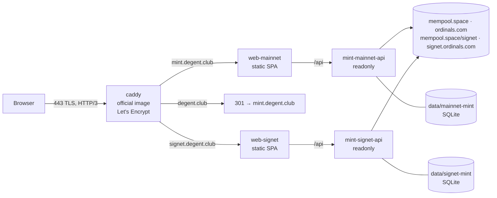

# The degent.club server (release 1)

One Ubuntu 22.04 server (`degent-club-test`, 170.75.173.105; 4 vCPU, 7.8 GiB RAM, 68 GB disk, 66 GB free) runs the
whole release. There are no bitcoin nodes on it: the mints read public APIs. This comfortably fits the release and leaves
room for a pruned signet bitcoind (or an esplora) later. GitHub Actions does everything; the owner runs nothing on the
server.

| Name | What | Mode today |
|---|---|---|
| `https://mint.degent.club` | the app on **mainnet** (Collection, Explorer, Home stats, How it works, Comic, Club holdings by address) | `MINT_MODE=readonly`: minting shows "Minting opens soon" |
| `https://degent.club` | 301 to `https://mint.degent.club` (path and query kept) | |
| `https://signet.degent.club` | the signet beta (persistent "Test network: signet coins have no value" banner) | `readonly` until the parentless mint lands |
| `www.degent.club` | not served (no DNS record). `WWW_REDIRECT=true` in the server `.env` adds a 301 once a record exists | |

Degents are **parentless** (ADR-0010, in progress): there is no parent key, policy signer, parent inscription or KMS
anywhere on this server. The current mint code refuses full mode without a parent, so both networks run read-only
(`/v1/config` and `/v1/health` report `mode`; every write answers 503 `mint_not_open`).

## Architecture

Workers (`mint-*-worker`) exist in `compose.server.yaml` and are scaled to 0 while a network is read-only.

| Where | What |
|---|---|
| `products/degent/deploy/compose.server.yaml` | the services above; images `ghcr.io/degentclub/degent-{mint,web-mainnet,web-signet}:<git sha>` + `caddy:2.8.4-alpine` |
| `products/degent/deploy/server/caddy/` | edge Caddyfile (HSTS + security headers, apex/www redirects) |
| `products/degent/deploy/server/bootstrap.sh` | idempotent server setup (runs before every deploy) |
| `products/degent/deploy/server/deploy.sh` | `deploy <sha> [both\|mainnet\|signet]`, `rollback`, `status`, `logs <service> [lines]`; JSON result line |
| `.github/workflows/deploy.yml` | gate → `pnpm check` → images to GHCR → bootstrap + deploy over SSH → smoke tests |
| server `/opt/degent/` | `bin/deploy.sh`, `compose/.env` (settings), `secrets/{mainnet,signet}/` (mode 600), `data/`, `releases/<sha>/` (bundle unpacked from the mint image), `state/` (current and previous tags) |

## Owner steps (in order)

1. **DNS** at the provider (done): `A degent.club`, `A mint.degent.club`, `A signet.degent.club` → `170.75.173.105`.
   Optional, for IPv6: `AAAA` for the same three names → `2602:ffb6:4:7685:f816:3eff:fef0:f465`.
2. **GitHub secret** `SERVER_PASSWORD` = the `ubuntu` user's password (Settings → Secrets and variables → Actions →
   New repository secret). That is the only required setting. Optional: variable `DEPLOY_HOST` (default
   170.75.173.105); secret `DEPLOY_KNOWN_HOSTS` to pin the host key (the first run prints the line to paste in its job
   summary; until then the first connection's key is accepted and kept for that run).
3. **Deploy**: push to `claude/magical-einstein-ugdy2r` (every push deploys), or Actions → *deploy* → Run workflow
   (`task`: `deploy`, `bootstrap` or `status`; manual runs need the workflow on the default branch).
4. **Verify**: the job's smoke step checks `https://mint.degent.club/api/v1/health` (`mode: readonly`), the home page,
   `https://degent.club/…` → 301 `https://mint.degent.club/…`, and `https://signet.degent.club/api/v1/health`. By hand:
   `curl -s https://mint.degent.club/api/v1/health`.
5. **GHCR**: nothing to do. The deploy job logs the server in to ghcr.io with its own short-lived `GITHUB_TOKEN`
   (piped over SSH on stdin, stored only in root's Docker credential store for the duration of the deploy, then
   `docker logout`). Making the `degent-*` packages public also works.
6. **Security** (recommended, not required): change the `ubuntu` password (`passwd`, then update `SERVER_PASSWORD`)
   because it was shared in plain text, and add an SSH key. bootstrap.sh never turns password logins off (the workflow
   uses them); it sets `PermitRootLogin no`, `MaxAuthTries 3`, ufw (22, 80, 443/tcp, 443/udp only) and fail2ban
   (5 failures in 10 min → 1 h ban).

## How the deploy job talks to the server

`sshpass -e` reads the password from the `SSHPASS` environment variable (from the secret; masked; never on a command
line). `sudo` runs without a prompt when the image grants NOPASSWD, otherwise the password is written as the first line
of stdin to `sudo -S -k` (never in argv). The job copies `bootstrap.sh` and `deploy.sh` to `~/degent-bootstrap/`, runs
`sudo bash bootstrap.sh` (idempotent: keeps secrets and settings), then `sudo /opt/degent/bin/deploy.sh deploy <sha> both`.

`deploy.sh deploy <sha>` pulls the images, unpacks `compose.server.yaml` + `caddy/` from the mint image into
`releases/<sha>/`, runs `docker compose up -d --remove-orphans` (workers scaled by mode), waits for every container to
be healthy (Caddy: running), and prints one JSON line. On failure it restarts the previous release and reports
`rolledBack: true`.

## Settings (`/opt/degent/compose/.env`, written by bootstrap.sh, existing values kept)

`SITE_DOMAIN=degent.club`, `MINT_DOMAIN=mint.degent.club`, `SIGNET_DOMAIN=signet.degent.club`, `APEX_REDIRECT=true`,
`WWW_REDIRECT=false`, `MAINNET_MINT_MODE=readonly`, `SIGNET_MINT_MODE=readonly`, `DEGENT_HOME`, `DEPLOY_UID/GID`.
Every variable is listed in `products/degent/deploy/compose-vars.json` (`server`). Secrets are files:
`secrets/{mainnet,signet}/{reveal-encryption-key,session-key}` (32 random bytes, hex; generated once).

**Opening minting** (after the parentless mint, ADR-0010, has merged and been reviewed): set `SIGNET_MINT_MODE=full`
(beta first), later `MAINNET_MINT_MODE=full`, in `/opt/degent/compose/.env`, and deploy again. That is the one-line
switch; the worker starts automatically.

## Rollback, logs, rotation

- Rollback: `sudo /opt/degent/bin/deploy.sh rollback [both|mainnet|signet]` (or redeploy an older sha).
- Status / logs: `sudo /opt/degent/bin/deploy.sh status`, `sudo /opt/degent/bin/deploy.sh logs mint-mainnet-api 200`.
- Rotate `session-key`: replace the file, redeploy (members sign in again). `reveal-encryption-key`: only with no
  orders in flight (RUNBOOK §2); read-only mode stores none.
- Hardened option for later: `WITH_DEPLOY_KEY=1 sudo bash bootstrap.sh` (by hand, never in CI) installs a key-only
  `deploy` SSH key whose forced command is `deploy.sh` (it reads `SSH_ORIGINAL_COMMAND` with the same grammar); the
  workflow would then use that key instead of the password.

## Public APIs this relies on (assumptions; not reachable from the build sandbox)

The mint calls esplora `GET /blocks/tip/height`, `/fee-estimates`, `/tx/:txid`, `/tx/:txid/outspends`,
`/address/:a/utxo`, `POST /tx` (mempool.space and mempool.space/signet serve these), and ord `/content/:id`,
`/r/inscription/:id` (JSON with `address`), `/r/utxo/:outpoint` (JSON with `inscriptions`), served by ordinals.com and
signet.ordinals.com on current ord versions. The browser calls the same hosts (CSP `connect-src`/`img-src` list them).
Limits: public rate limits and outages degrade `/v1/health` (still 200, `status: degraded`), holder lookups and
fees; no SLA. Move to own nodes (a pruned bitcoind + esplora + ord; the disk has room for signet) before minting opens
on mainnet at volume. Deferred (roadmap p4.20–p4.23): backups of the SQLite volumes, the host-key pin as default,
the launch limits (`MAX_PAID_ORDERS_PER_DAY=25`, the "Beta: real bitcoin, unaudited" acknowledgement), own nodes.
