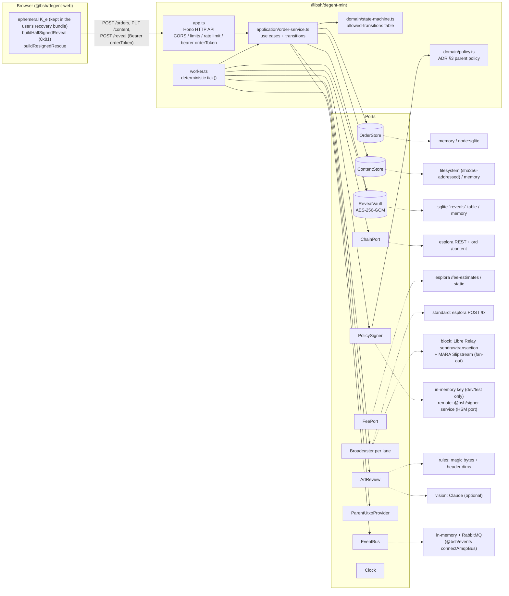

# @bsh/degent-mint

Automated, non-custodial mint service for degent.club (ADR-0002, amended by
[ADR-0005](../../../../docs/adr/0005-strict-reveal-and-tiers.md)). Takes an order, reviews the art before
payment, stores the user's half-signed reveal (SIGHASH_ALL|ANYONECANPAY, parent return pre-signed), watches
for the commit, inserts the collection parent input, has the policy signer co-sign input 0, broadcasts
through the lane the reveal's weight requires (block lane packed by a per-block weight budget), then tracks
the order to `delivered` after checking ord serves the exact bytes. If it cannot reveal in time, it hands
the user the inputs to re-sign a parent-less rescue with their own key K_e.

Contracts: [`contracts/openapi/degent-mint.yaml`](../../../../contracts/openapi/degent-mint.yaml) (HTTP) and
[`contracts/asyncapi/degent-mint.yaml`](../../../../contracts/asyncapi/degent-mint.yaml) (events). Shared rules,
types and the typed client: [`@bsh/degent-mint-sdk`](../../packages/mint-sdk/README.md). All weight, fee,
commit-address and PSBT maths: `@bsh/inscription`.

## Architecture (ports and adapters)



Layout:

| Path | What |
|---|---|
| `src/domain/` | Pure: state machine, parent policy, quote maths (via `@bsh/inscription`), address checks, errors |
| `src/ports/` | Interfaces only |
| `src/adapters/` | Implementations: stores, vault, esplora chain/fees, broadcasters, signers, reviewers, bus |
| `src/application/` | `OrderService` (API use cases, every transition), settings, logger |
| `src/app.ts`, `src/admin.ts` | HTTP API; operator endpoints (`/v1/admin/*`, scope `mint:admin`) |
| `src/worker.ts` | Order progression |
| `src/config.ts`, `env.schema.json` | Env -> typed config, fail-fast |
| `src/wiring.ts`, `src/main.ts` | Composition root (`startRuntime`: bus connect + signer preflight) and entry point |
| `src/reinit-parent.ts` | Operator one-off: re-lease the parent to a checked outpoint (RUNBOOK section 8) |
| `test/fakes/` | Fake chain + ord, clock, broadcasters, reviewer, test harness and "browser" |

## Order lifecycle

```
awaiting_content -> reviewing -> approved | rejected
approved -> awaiting_payment              (half-signed reveal verified + stored)
awaiting_payment -> paid -> queued -> revealing -> revealed -> confirmed -> verified -> delivered
pre-paid states -> expired  (expired -> paid if the commit is funded late: the fee is fixed in the commit)
paid | queued | revealing -> rescue_available -> revealed (commit spent on chain: rescue or late reveal)
awaiting_payment -> failed (commit funded with the wrong value/script), confirmed -> failed (ord bytes differ)
revealing -> queued (broadcast rejected; lease released)
```

The table in `src/domain/state-machine.ts` is authoritative; illegal transitions throw. Every transition is
persisted with a timestamp in `timeline` and emitted as `degent.mint.order.<status>`.

## How the pieces fit

1. **POST /v1/orders** validates metadata with the SDK rules, the recipient (taproot, right network), `K_e`
   (valid x-only point) and fee rate, and returns an *indicative* quote (weight depends only on length, so
   it already equals the binding weight) plus a one-time random `orderToken` (only its SHA-256 is stored).
2. **PUT /v1/orders/{id}/content** (Bearer token): length and SHA-256 must match the declaration; the
   `ArtReview` chain (rules, then optional vision) runs **before** any transition. Approved content is stored
   content-addressed and the *binding* quote (with `commitAddress`) is returned.
3. **POST /v1/orders/{id}/reveal** (Bearer token): `verifyHalfSignedReveal` with `expectedSighash:
   'all_anyonecanpay'` against the stored bytes, recipient, postage, commit outpoint and value **and** the
   parent return output 0 = (`collectionAddress`, `PARENT_VALUE_SATS`). 0x83 reveals are refused. With 0x81 a
   holder can no longer add, swap or resize outputs; the PSBT is still stored AES-256-GCM encrypted (AAD =
   order id) in a separate `reveals` table, never logged, emitted, or returned.
4. **Worker tick**: chain progress first (confirmations, ord verification, delivery, rescue spends), then
   payment detection (exact value and script), expiry, queueing, retries, rescue timeouts, and dispatch:
   lease parent (value must equal `PARENT_VALUE_SATS`, else reveals pause and log) -> `attachParent` (inserts
   the parent input; output 0 is already signed) -> `PolicySigner.sign` (policy check, then
   `signParentInput`) -> `finalizeReveal` (weight asserted equal to the quote) -> lane broadcaster. On
   success the new parent is output 0 of that reveal.
5. **Tiers and lanes (ADR-0005 §3-§4).** Tier = content bytes (`standard` 200-400 KB, `large` 400 KB-3.5 MB,
   `fullblock` 3.5-3.9 MB). Lane = reveal weight (<= 400,000 WU standard, else block); a 397-400 KB Standard
   Degent is quoted `lane: 'block'`. Block lane: a **3,990,000 WU per-block budget**; reveals in flight
   (revealing or unconfirmed) plus the next one must fit, and a Full Block Degent never shares (`fitsInFlight`
   from the SDK). Several Large Degents go into one block; the first that does not fit waits for the next
   block (no overtaking). Queue position = block slot (`packBlockSlots`), ETA = slot x ~10 min. Standard lane:
   `STANDARD_CONCURRENCY` in flight, may chain on unconfirmed standard parents, never on an unconfirmed
   block-lane parent. New block-lane orders are refused (`queue_full`) when their slot's ETA would exceed 80%
   of the rescue timeout.
6. **Rescue (ADR-0005 §2).** In `rescue_available`, `GET /rescue` returns `RescueInputs` (commit outpoint and
   value, content hash, parent id, recipient, reveal pubkey, postage, exact rescue weight, implied and
   suggested fee rates). The browser re-signs `[commit] -> [child]` with K_e from the user's recovery bundle;
   the service holds nothing it could broadcast without the parent and never sees K_e.

Policy signer (ADR §3), stricter in one respect: the parent return must equal the parent input value
**exactly** (a larger output 0 would swallow the child sat). It also checks the commit script, recipient,
postage, the lane fee band and that the fee rate matches the quote. A refusal moves the order straight to
`rescue_available`.

## Artwork orders and royalties (Open Studio, ADR-0007, plan §3)

A member mints a studio artwork with `POST /v1/orders` carrying `artworkId` (the web app copies the artwork
record's `contentType`, `contentLength` and `contentSha256`). The service:

1. **Takes the facts and the bytes from the studio** (`StudioClient`: `GET /v1/artworks/{id}`, the artist's
   profile for the proven payout address, `GET /v1/artworks/{id}/content`) and refuses what plan §3.1 says
   to refuse: 404 `artwork_not_found`; 409 `artwork_not_mintable` unless the artwork is `approved`; 409
   `artist_payout_missing` without a P2WPKH / P2TR payout address; 422 `content_mismatch` when the declared
   facts differ from the record. The review happened at submission (ADR-0007 §4), so the upload step is
   skipped: the order is created and walked `awaiting_content -> reviewing -> approved` (timeline detail
   `artwork <id> reviewed at submission`) and returned `approved` with a **binding** quote.
2. **Reserves the edition** (`EditionStore`, per artwork, in the order store's meta) for the quote's TTL. The
   reservation becomes `Order.edition` at `paid`; an expired one is released and may go to a later order; a
   late payer re-claims its quoted number while it is still free, otherwise the order is offered self-rescue
   (its reveal was signed with a number that is no longer its own).
3. **Quotes the split** (`@bsh/degent-mint-sdk.computeRoyaltySplit`): `clubFeeSats = floor(commitValue x
   CLUB_FEE_BPS_<TIER> / 10000)` (replaces the flat service fee, which is 0 on artwork orders),
   `mintPriceSats = commitValue + clubFee`, `artistRoyaltySats = floor(mintPrice x ROYALTY_BPS / 10000)` raised
   to the payout script's dust limit (P2TR 330, P2WPKH 294; `royaltyRaisedToDust` says so),
   `totalSats = commitValue + clubFee + royalty`. The quote carries `artistAddress`, `artworkId`,
   `mintPriceSats` and the reserved `edition`.
4. **Signs attribution into the envelope** (plan §3.4): the browser builds the content with
   `attribution: { artist, artwork, edition, studio: 'degent.club' }` (ord tag 5, canonical CBOR via
   `@bsh/inscription.encodeAttribution`), which changes the commit address and the exact reveal weight; the
   quote already accounts for it. `POST /reveal` recomputes the same envelope: a reveal built without the
   metadata, or with another edition, is `reveal_invalid`. `GET /rescue` returns `artworkId`, `artistAddress`
   and `edition` so the recovery bundle reproduces the envelope.
5. **Verifies the funding transaction by script** (plan §3.3, `worker.detectArtworkPayment`): after the
   commit output matches, every output paying the artist's payout script and the club script
   (`SERVICE_FEE_ADDRESS`) is summed and compared with the quote (`domain/royalty.ts`, never address
   strings). The order is `paid` either way (the commit is funded) and the edition is assigned; a short or
   missing output moves it straight to `rescue_available` naming the output, and the parent is never
   co-signed. A satisfied artist output is recorded as `royaltyPaid { txid, vout, sats }`.
6. **Reports the royalty**: `degent.mint.royalty.paid` is emitted once and the record is `POST`ed to the
   studio's `/v1/internal/royalties` (idempotent on `orderId`), retried with backoff (30 s doubling, capped at
   1 h) on later ticks. A failed post never blocks the mint; a non-retryable refusal (e.g. 409 conflicting
   facts) stops the retries and logs for an operator (`royaltyReport.gaveUp`). Both wait while the funding
   transaction is unconfirmed **and** RBF-signalling (the order itself proceeds as any unconfirmed commit does).
7. **Records the ledger** (plan §3.5, platform `@bsh/ledger` 1.2): a ledger order (`product: degent`,
   `customerRef` = recipient) with line items `network-cost` (payee `platform:commit`, the commit address -
   the psbt method needs a payee on every line), `club-fee` (payee `club:degent-club`) and `artist-royalty`
   (payee `artist:<address>`), a `psbt` intent (expected outputs = the funding layout), and, once paid, the
   observed funding transaction (`POST /v1/payments/{id}/observations`, unconfirmed first, again when
   confirmed) from which the ledger records one payout per payee output. Idempotency keys
   `degent-mint:<orderId>:{order,payment}`; retried with backoff; never blocks.
8. **Publishes `collection.minted`** (platform topic 1.1.0) on `delivered` for every parent-linked mint, with
   `artist`, `artworkId`, `edition` and `royalty` on artwork orders (a rescued child has no parent link and
   is not announced).

The funding transaction the browser builds is `[commit, artist royalty, club fee, change]` (plan §3.2); the
reveal is unchanged (ADR-0005), so a rescue changes nothing for the artist: they were paid when the minter
paid (ADR-0007 §5). The shared `degent.mint.order.{status}` payload is untouched (platform-owned topic).

Configuration: `STUDIO_URL` + `STUDIO_API_KEY` (scope `studio:internal`), `LEDGER_URL` + `LEDGER_API_KEY`,
`ROYALTY_BPS` (default 1000), `CLUB_FEE_BPS_{STANDARD,LARGE,FULLBLOCK}` (default 1000; `SERVICE_FEE_ADDRESS`
required when > 0 with a studio). Without `STUDIO_URL` artwork orders are refused (`GET /v1/config` says
`studioUrl: null`); on regtest an empty in-memory studio and ledger are wired. Tests use `MemoryStudioClient`,
`MemoryLedgerClient` and the fake chain (`test/artwork-orders`, `test/royalty-worker`, `test/artwork-e2e`).

Known gaps: the studio does not expose the artist's payout address on `GET /v1/artists/{address}` yet
(`HttpStudioClient` reads `payoutAddress` from that profile when present, else "not proven"); the
`report-royalty` / `record-ledger` worker steps scan `delivered` rows each tick (an index is Phase 5 work).

## API summary

| Method | Path | Auth | Result |
|---|---|---|---|
| GET | `/v1/health` | - | status + checks (store, chain, parent, bus, signer; `parentValue` while the value breaker is open) |
| GET | `/v1/config` | - | collection rules, three tiers, collection address, `parentValueSats`, upload limit |
| GET | `/v1/fees` | - | sat/vB per lane |
| GET | `/v1/queue` | - | lane waiting / in-flight / capacity / ETA; block lane `weightBudget` + `inFlightWeight` |
| POST | `/v1/orders` | - | 201 `{ order, orderToken }`; with `artworkId` the order comes back `approved` (Open Studio) |
| PUT | `/v1/orders/{id}/content` | Bearer | raw bytes (`application/octet-stream`, <= 4 MiB) -> approved/rejected order |
| POST | `/v1/orders/{id}/reveal` | Bearer | `SubmitRevealRequest` -> `awaiting_payment` |
| GET | `/v1/orders/{id}` | - | public order (no PSBT, no token) |
| GET | `/v1/orders/{id}/rescue` | Bearer | `RescueInputs` when `rescue_available` (never a tx), else 409 |
| POST | `/v1/admin/parent/ack` | admin API key (`mint:admin`) | close the parent value circuit breaker for the named parent (RUNBOOK section 8); 409 on a stale parent |

Errors are always `{ "error": { "code", "message", "details"? } }`. 401 = no/malformed token, 403 = wrong
token or disallowed origin, 413 body too large, 415 wrong content type, 422 validation, 429 rate limited.

## Configuration

See [`env.schema.json`](./env.schema.json) for every variable. Essentials:

| Variable | Notes |
|---|---|
| `NETWORK` | required; `regtest` enables dev defaults (in-memory stores, dev reveal key, random parent key) |
| `DATABASE_PATH`, `CONTENT_DIR` | sqlite file and blob dir (required off regtest) |
| `ESPLORA_URL`, `ORD_URL` | chain + ord backends |
| `LIBRE_RPC_URL/USER/PASS`, `SLIPSTREAM_URL/API_KEY` | block lane (mainnet needs at least one; both = fan-out) |
| `PARENT_INSCRIPTION_ID`, `PARENT_OUTPOINT`, `COLLECTION_ADDRESS` | parent identity, initial location, key address |
| `PARENT_VALUE_SATS` | constant parent UTXO value (default 10,000); browsers sign output 0 with it; startup refuses a `PARENT_OUTPOINT` of another value |
| `SIGNER`, `PARENT_KEY_FILE` | `memory` + key file is dev-only; **mainnet refuses to start** with it. `remote` = platform signer (below) |
| `REVEAL_ENCRYPTION_KEY` | 32-byte hex AES key for stored reveals (required off regtest) |
| `CORS_ORIGINS` | exact origins, comma-separated; empty = deny all |
| `ART_REVIEW_API_KEY` | enables the Claude vision review (`claude-opus-5`); unset = rules only |
| `SERVICE_FEE_ADDRESS`, `SERVICE_FEE_SATS_{STANDARD,LARGE,FULLBLOCK}` | optional per-tier service fee, paid in the funding tx (plain orders) |
| `STUDIO_URL`, `STUDIO_API_KEY` | Open Studio: artwork orders from `@bsh/degent-studio` (key scope `studio:internal`) |
| `LEDGER_URL`, `LEDGER_API_KEY` | platform ledger recording of artwork orders (never blocks a mint) |
| `ROYALTY_BPS`, `CLUB_FEE_BPS_{STANDARD,LARGE,FULLBLOCK}` | artist royalty (of the mint price) and club fee (of the network cost) in basis points; defaults 1000 |

Config errors are listed all at once and the process exits non-zero.

### Production configuration

Off regtest the service is durable by default and there is no in-memory fallback; mainnet adds the remote
signer and the event bus. Startup (`startRuntime`) refuses to serve until the bus answers and the signer is
verified.

| Concern | Variables | signet / testnet | mainnet |
|---|---|---|---|
| Orders, encrypted reveals, editions, parent state + value alert | `DATABASE_PATH` (node:sqlite) | required | required |
| Artwork/content blobs | `CONTENT_DIR` (filesystem, sha256-addressed) | required | required |
| Parent co-signer | `SIGNER=remote`, `SIGNER_URL`, `SIGNER_API_KEY` (secret `services/degent-mint/signer-api-key`, scope `sign:<keyId>`), `SIGNER_KEY_ID`, `SIGNER_TIMEOUT_MS`, `SIGNER_RETRIES` | `remote` recommended (`memory` + `PARENT_KEY_FILE` allowed) | **`remote` only**; live API key; preflight checks network + `COLLECTION_ADDRESS`. Signer-side policy: RUNBOOK section 7 |
| Event bus | `AMQP_URL` (secret `services/degent-mint/amqp-url`), `AMQP_EXCHANGE` (`bsh.events`), `AMQP_CONNECT_TIMEOUT_MS` | optional (warning when unset: events stay in-process) | **required**; startup health check; exit on connection loss (supervisor restarts) |
| Operator endpoints | `MINT_ADMIN_API_KEYS_JSON` (secret `services/degent-mint/admin-api-key-hashes`, hash-only, scope `mint:admin`) | `test` keys | `live` keys; warning when unset (a parent value change then needs a redeploy to clear) |
| Parent | `PARENT_INSCRIPTION_ID`, `PARENT_OUTPOINT`, `PARENT_VALUE_SATS`, `COLLECTION_ADDRESS` | required | required; `parent.lease.changed` / `parent.value.changed` alerting (RUNBOOK section 8) |

`amqplib` is the platform's optional peer of `@bsh/events`; it is installed next to `@bsh/events` in this
workspace and `connectAmqpBus` loads it from there, so the mint declares no npm dependency of its own.

## Run locally

```bash
pnpm --filter @bsh/degent-mint dev          # NETWORK=regtest, in-memory, http://127.0.0.1:8787
curl -s localhost:8787/v1/config | jq .

# against a local regtest esplora + ord
NETWORK=regtest ESPLORA_URL=http://127.0.0.1:3002 ORD_URL=http://127.0.0.1:8080 \
  PARENT_OUTPOINT=<txid>:<vout> PARENT_KEY_FILE=./dev-parent.key \
  CORS_ORIGINS=http://localhost:5173 pnpm --filter @bsh/degent-mint dev

pnpm --filter @bsh/degent-mint test         # unit + API + worker + e2e on a fake regtest chain
pnpm --filter @bsh/degent-mint typecheck
```

Operations: [RUNBOOK.md](./RUNBOOK.md).

## Known gaps

- The remote signer's env policies cannot pin output 0 (collection address, same value); the mint's own policy and
  the browser's 0x81 signature do. Follow-up: a `parentReturn` taproot policy in the platform signer.
- `RemotePolicySigner` uses the global `fetch`; mTLS to the signer needs an injected client-certificate `fetch`
  (`RuntimeDeps.signerFetch`) or a private network / sidecar that terminates it.
- The event backlog is in memory: events unpublished at shutdown are logged (`event.publish.lost`) for replay from
  the order timeline, not persisted. A durable outbox (`@bsh/events` `OutboxPublisher` over SQLite) is future work.
- Artist notifications on `royalty.paid` and persisted notify subscriptions (the rest of plan p5.3) are not in this
  service.
- The rate limiter is per process; run one API replica or put a shared limiter in front.
- The service trusts one esplora; a second backend for cross-checking payment detection is future work.
